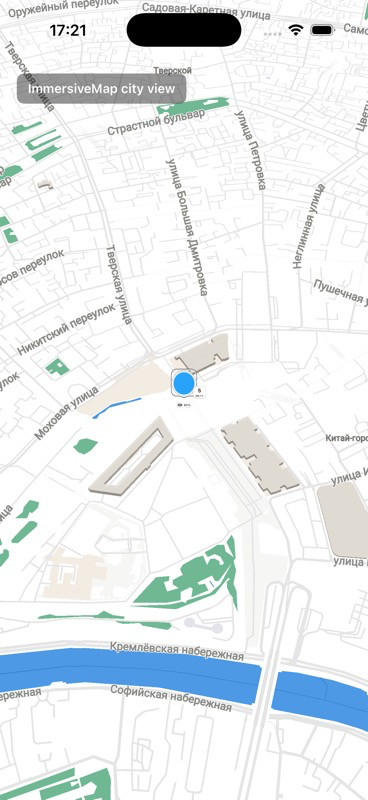
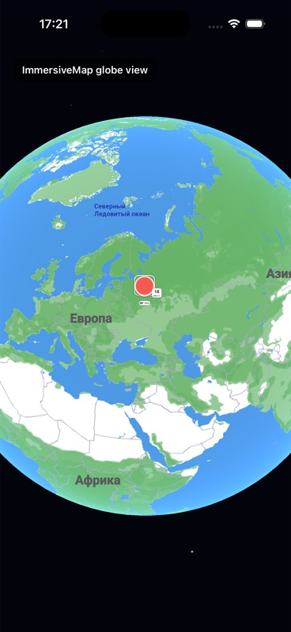

# ImmersiveMap

ImmersiveMap is a standalone iOS Metal map engine extracted from the Tucik iOS app.

It provides:

- `ImmersiveMapView` for SwiftUI.
- `ImmersiveMapUIView` for UIKit.
- Flat and globe presentation modes.
- Vector tile loading and parsing.
- Roads, land, water, buildings, labels, POI icons, trees, and avatar markers.
- Runtime configuration through `MapSettings`.

## Screenshots

<p>
  
  
</p>

## Requirements

- iOS 18.0+
- Xcode with Metal support
- Swift Package Manager

## Installation

In Xcode:

1. Open your app project.
2. Select `File` -> `Add Package Dependencies...`.
3. Enter:

```text
https://github.com/artemcolt/ImmersiveMap.git
```

4. Add the `ImmersiveMap` product to your app target.

If you manage dependencies in `Package.swift`, add:

```swift
.package(url: "https://github.com/artemcolt/ImmersiveMap.git", branch: "main")
```

Then add the product to your target:

```swift
.product(name: "ImmersiveMap", package: "ImmersiveMap")
```

## Tile Server

ImmersiveMap renders Mapbox Vector Tile (`.mvt`) data. You must provide a tile endpoint that returns vector tiles at this URL shape:

```text
{tileBaseURL}/{z}/{x}/{y}.mvt
```

For example, if `tileBaseURL` is:

```text
https://example.com/api/v1/map/tiles
```

the map will request:

```text
https://example.com/api/v1/map/tiles/12/2411/1539.mvt
```

If your tile server requires a bearer token, set `authorizationToken`. If it does not require authentication, leave the token as `nil`.

## Demo App

This repository includes a small runnable demo at `Examples/ImmersiveMapDemo`.

Open `Examples/ImmersiveMapDemo/ImmersiveMapDemo.xcodeproj` in Xcode and run the `ImmersiveMapDemo` scheme on an iOS Simulator.

The demo reads optional launch environment variables:

```text
IMMERSIVE_MAP_TILE_BASE_URL=https://example.com/api/v1/map/tiles
IMMERSIVE_MAP_AUTH_TOKEN=your-token
```

Do not commit bearer tokens. Use Xcode scheme environment variables, or launch the installed simulator app with `SIMCTL_CHILD_IMMERSIVE_MAP_AUTH_TOKEN` when you need to test a protected tile server.

## SwiftUI Quick Start

```swift
import SwiftUI
import ImmersiveMap

struct MapScreen: View {
    private let camera = MapCameraController()
    private let avatars = AvatarsController()

    var body: some View {
        ImmersiveMapView(
            settings: mapSettings,
            avatarsController: avatars,
            cameraPosition: .init(
                latitudeDegrees: 55.7558,
                longitudeDegrees: 37.6173,
                zoom: 12,
                bearing: 0,
                pitch: 0
            ),
            cameraController: camera
        )
        .ignoresSafeArea()
    }

    private var mapSettings: MapSettings {
        var settings = MapSettings.default
        settings.tiles.network.tileBaseURL = URL(string: "https://example.com/api/v1/map/tiles")!
        settings.tiles.network.authorizationToken = nil
        return settings
    }
}
```

## UIKit Quick Start

```swift
import UIKit
import ImmersiveMap

final class MapViewController: UIViewController {
    private let camera = MapCameraController()
    private let avatars = AvatarsController()

    override func viewDidLoad() {
        super.viewDidLoad()

        var settings = MapSettings.default
        settings.tiles.network.tileBaseURL = URL(string: "https://example.com/api/v1/map/tiles")!

        let mapView = ImmersiveMapUIView(
            frame: view.bounds,
            settings: settings,
            avatarsController: avatars,
            cameraPosition: .init(
                latitudeDegrees: 55.7558,
                longitudeDegrees: 37.6173,
                zoom: 12
            )
        )

        mapView.autoresizingMask = [.flexibleWidth, .flexibleHeight]
        view.addSubview(mapView)
        camera.attach(mapView: mapView)
    }
}
```

## Camera Control

Keep a `MapCameraController` and pass it to `ImmersiveMapView`.

```swift
let camera = MapCameraController()

camera.jump(to: .init(
    latitudeDegrees: 48.8566,
    longitudeDegrees: 2.3522,
    zoom: 13
))

camera.fly(to: .init(
    latitudeDegrees: 40.7128,
    longitudeDegrees: -74.0060,
    zoom: 11,
    bearing: .pi / 7,
    pitch: .pi / 4
))
```

`latitudeDegrees` and `longitudeDegrees` use degrees. `bearing`, `pitch`, and camera pitch settings use radians.

## Avatar Markers

Use `AvatarsController` to show moving people, vehicles, or other live objects on the map.

```swift
import UIKit
import ImmersiveMap

let avatars = AvatarsController()

avatars.set([
    AvatarMarker(
        id: 1,
        coordinate: GeoCoordinate(latitude: 55.7558, longitude: 37.6173),
        image: UIImage(named: "avatar")!,
        batteryBadge: AvatarBatteryBadge(levelPct: 82),
        speedBadge: AvatarSpeedBadge(kilometersPerHour: 5),
        isSelected: true
    )
])

avatars.move(id: 1, latitude: 55.7562, longitude: 37.6180)
```

## Selection

Attach a `MapSelectionController` if you need callbacks when users tap map objects or empty background.

```swift
let selection = MapSelectionController()

selection.onSelectionChanged = { event in
    print("Selected:", event.selection)
}

selection.onSelectionCleared = { event in
    print("Cleared:", event.previousSelection)
}

selection.onMapBackgroundTap = { point in
    print("Background tap:", point)
}
```

Pass it into SwiftUI:

```swift
ImmersiveMapView(
    settings: settings,
    selectionController: selection
)
```

## Common Configuration

```swift
var settings = MapSettings.default

settings.tiles.network.tileBaseURL = URL(string: "https://example.com/api/v1/map/tiles")!
settings.tiles.network.authorizationToken = "your-token"
settings.tiles.network.maxConcurrentFetches = 6

settings.renderLoop.forceContinuousRendering = false
settings.camera.maximumZoom = 18
settings.camera.maximumPitch = Float.pi * 65 / 180
settings.debug.overlayEnabled = false
```

## Build This Package

```bash
xcodebuild \
  -scheme ImmersiveMap \
  -destination 'generic/platform=iOS Simulator' \
  -derivedDataPath DerivedData \
  build
```

## Notes

- The package contains Metal shaders and runtime resources. Always add it as a Swift Package product, not by copying individual Swift files.
- The tile parser is designed for vector tiles with layers and attributes used by the engine's style system. If your tile source uses a different schema, you may need to adjust parsing or styling code.
- The default settings are suitable for development, but production apps should explicitly set `tileBaseURL` and cache/network settings.

## License

MIT. See [LICENSE](LICENSE).
