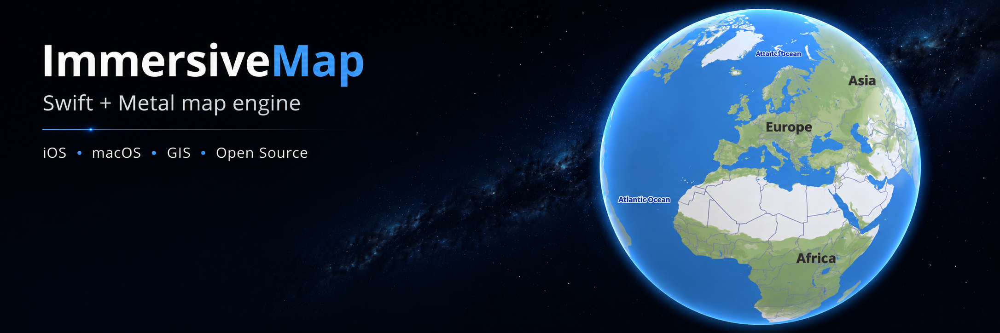

# ImmersiveMap



Swift + Metal map engine for SwiftUI.

## Add To Xcode

In Xcode, select `File` -> `Add Package Dependencies...` and add:

```text
https://github.com/artemcolt/ImmersiveMap.git
```

Then add the `ImmersiveMap` product to your app target.

## SwiftUI

```swift
import SwiftUI
import ImmersiveMap

struct ContentView: View {
    @State private var camera = ImmersiveMapCameraController()
    private let mapboxAccessToken = "your-mapbox-public-token"

    var body: some View {
        ImmersiveMapView()
            .camera(
                camera,
                position: .init(
                    latitudeDegrees: 55.7558,
                    longitudeDegrees: 37.6173,
                    zoom: 12
                )
            )
            .tileProvider(MapboxTileProvider(accessToken: mapboxAccessToken))
            .mapStyle(MapboxMapStyle())
            .ignoresSafeArea()
    }
}
```
